### 开源版Takin Demo接入体验
####操作步骤：

1.搭建本地Takin环境   

2.下载EasyDemo包

```
useradd takin
su - takin
cd /home/takin
curl -O https://install-pkg.oss-cn-hangzhou.aliyuncs.com/demo/easydemo.tgz
```

3.解压软件包，配置本地环境

```
tar xvf easydemo.tgz 
cd easydemo && vim env.conf
```

4.执行安装脚本脚本 

 ```
sh ./demoInstall.sh
 ```

5.登录控制台，配置白名单和和影子表

6.执行curl脚本，验证影子库表写入是否成功

```
sh ./curl.sh
```

7.登录控制台，上传压测脚本，配置压测场景开始执行压测


> *技术支持 三井   微信 i_roadfly 。为了保障良好的沟通效果，请加之前备注 （takin ，以及您所在的企业名称、所在岗位）*

### 调用关系

CURL --> Easydemo-gateway--> Easydemo-usercenter-> MySQL（真实表、影子表）

Takin 控制台（链路调试）--> Easydemo-gateway--> Easydemo-usercenter-> MySQL（真实表、影子表）

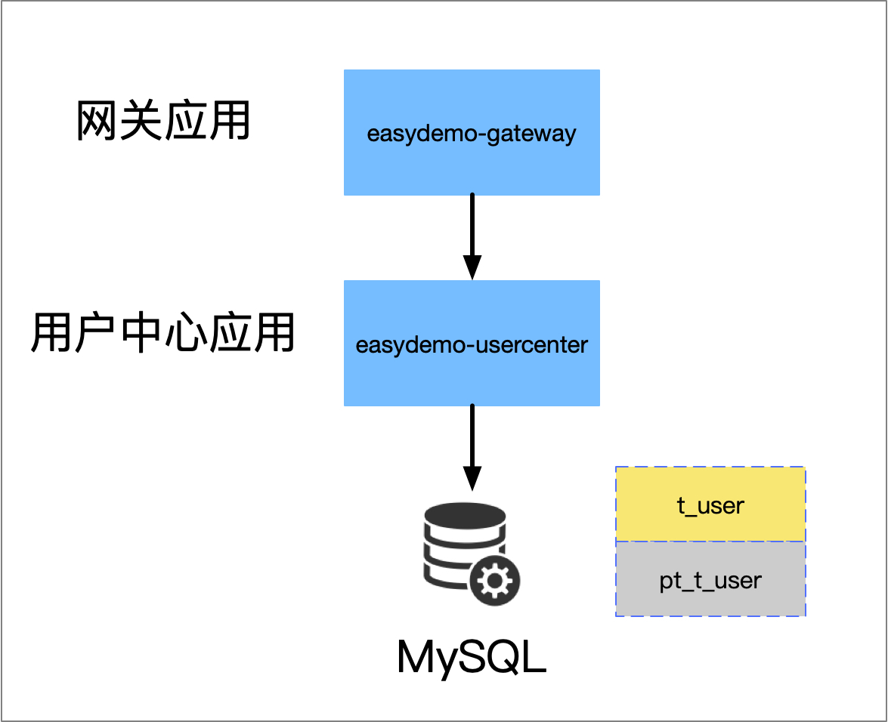
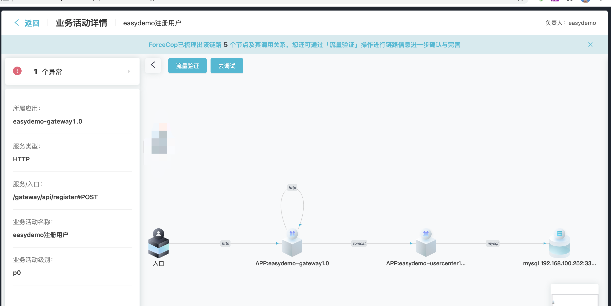


### 登录生产压测控制台 Takin

http://ip:port/  

用户名： admin  密码：pamirs@2020

### 应用目录
```bash
cd /home/takin/easydemo 
```

### 启动应用 

```
cd ~/easydemo/app/gateway
sh gateway.sh  start

cd ~/easydemo/app/user
sh usercenter.sh start
```

#### 执行业务流量到真实表(t_user)    
```
echo 1 | sh curl.sh

{"code":200,"data":"统计业务表数据: 0","error":null}
{"code":200,"data":"统计影子表数据: 0","error":null}
开始发起流量......
流量发完，统计结果
{"code":200,"data":"统计业务表数据: 2","error":null}
{"code":200,"data":"统计影子表数据: 0","error":null}

```
### 添加业务活动

URL http://ip:port/#/businessActivity


添加成功

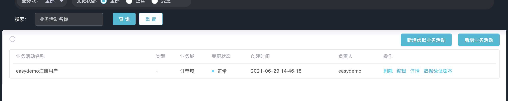

### 添加业务流程

URL http://ip:port/#/businessFlow

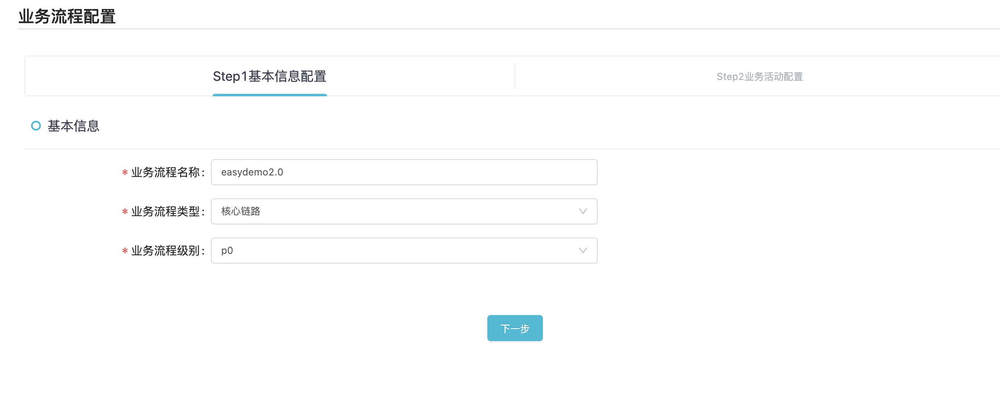
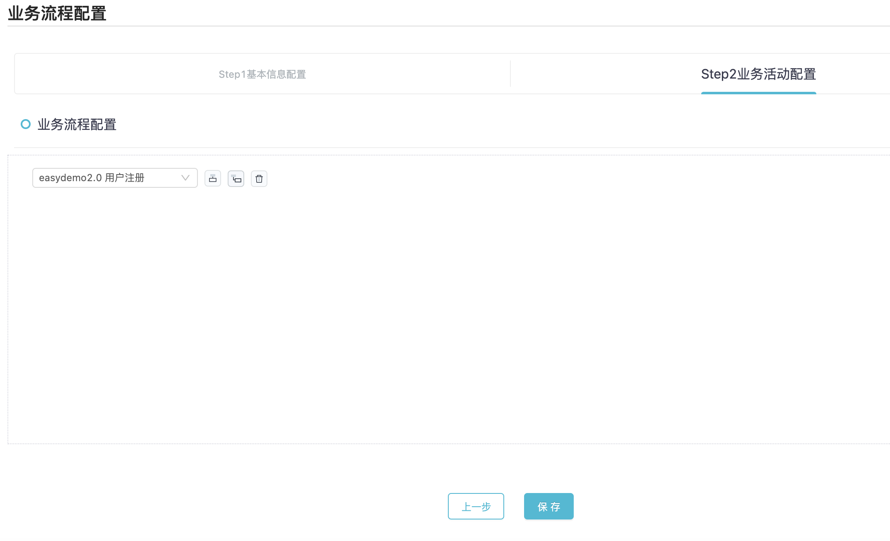

### 应用管理
url http://ip:port/#/appManage

#### gateway应用 ，添加调用白名单

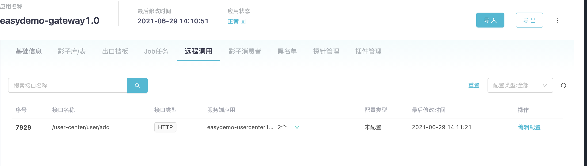
添加白名单
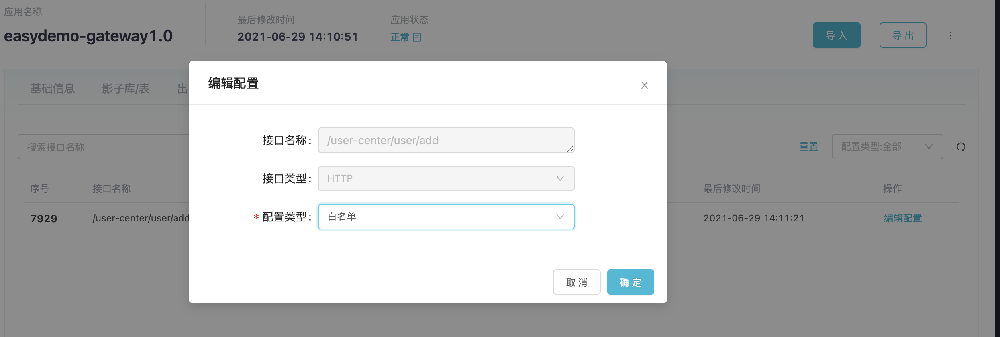


### usercenter应用，添加影子表配置

```
数据源链接：jdbc:mysql://127.0.0.1:3306/easydemo_db
表名：pt_t_user

```

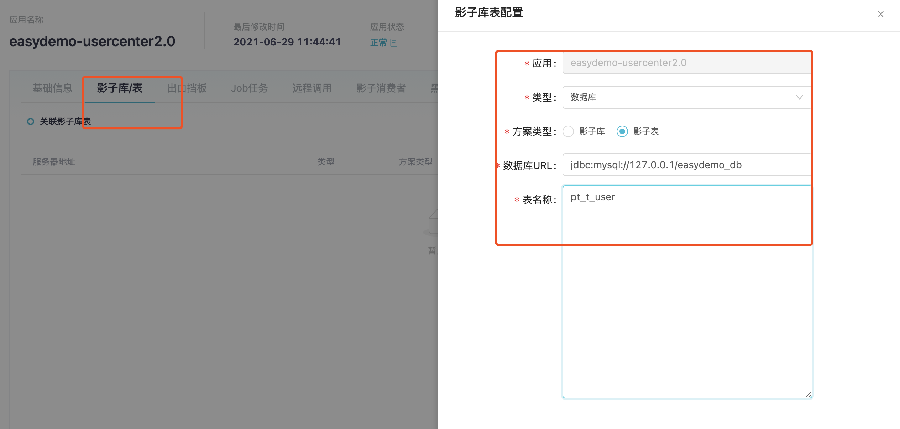


### 执行压测流量到影子表(pt_t_user)
``` 
echo 2 | sh curl.sh

{"code":200,"data":"统计业务表数据: 2","error":null}
{"code":200,"data":"统计影子表数据: 0","error":null}
开始发起流量......
流量发完，统计结果
{"code":200,"data":"统计业务表数据: 2","error":null}
{"code":200,"data":"统计影子表数据: 3","error":null}
 
```

### 查看应用接入状态 

http://ip:port/#/appManage

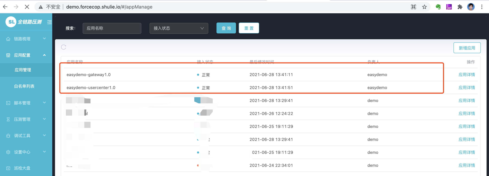


#### easydemo-gateway 应用状态

http://ip:port/#/appManage/details?tabKey=0&id=6814481948296089600


主要看一下 远程调用和插件管理的状态

#### easydemo-usercenter应用状态
http://ip:port/#/appManage/details?tabKey=0&id=6814481944844177408


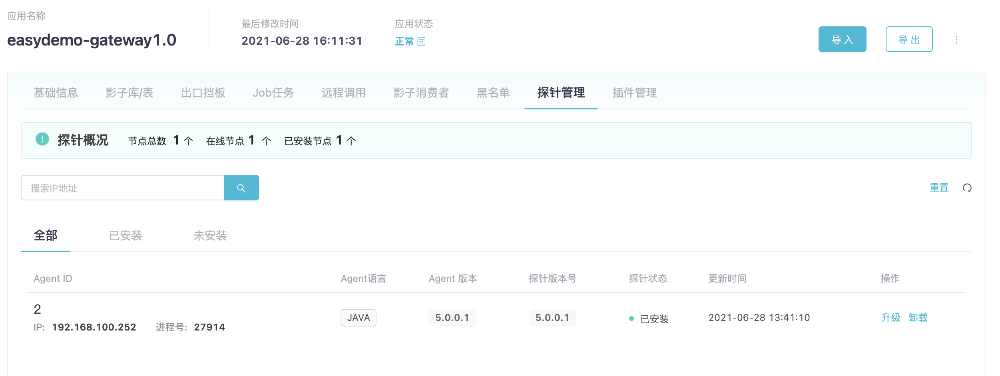


### 压测脚本
http://ip:port/#/scriptManage


<a href="images/login.jmx" alt="链">样例脚本🔗</a>


### 压测场景

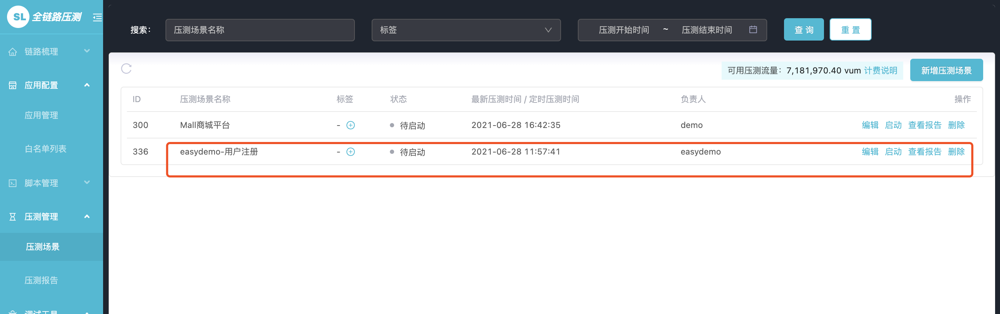

### 压测报告


### 查看影子表里面的数据量

```
###查看真实表的数据
mysql -h127.0.0.1 -udemo_db_user -pdemo_db_passwd easydemo_db -P3306 -e"select count(*) from t_user"

###查看影子表的数据

mysql -h127.0.0.1 -udemo_db_user -pdemo_db_passwd easydemo_db -P3306 -e"select count(*) from pt_t_user"

mysql: [Warning] Using a password on the command line interface can be insecure.
+----------+
| count(*) |
+----------+
|    33001 |
+----------+
```
可以在进行压测之前，查看压测数据是否都落入到影子表(pt_t_user)

